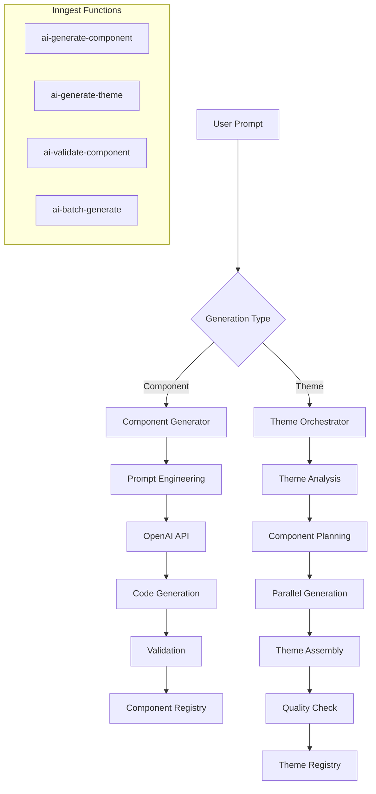

# Theme-Based Component Architecture Documentation

## Overview
This document provides detailed architectural guidance for implementing the theme-based component system in the Puck editor.

## Core Concepts

### 1. Theme vs Style
- **Theme**: A complete set of components designed for a specific industry or use case
- **Style**: Visual properties like colors, fonts, spacing (existing CheckoutThemeConfig)
- **Key Difference**: Themes provide different components, not just different styling

### 2. Component Organization

```
Current Structure (All components mixed):
/puck/
  ├── headers/
  ├── heroes/
  └── content/

New Structure (Theme-based):
/puck/
  └── themes/
      ├── e-commerce/
      │   ├── products/
      │   ├── shopping/
      │   └── marketing/
      ├── saas/
      │   ├── pricing/
      │   ├── features/
      │   └── demos/
      └── education/
          ├── courses/
          ├── lessons/
          └── assessments/
```

### 3. Theme Examples

#### E-commerce Theme Components
- **ProductCard**: Display individual products with image, price, rating
- **ProductGrid**: Responsive grid layout for product listings
- **ShoppingCart**: Full cart with quantity controls and calculations
- **FlashSale**: Time-limited offer component with countdown
- **ReviewCarousel**: Customer reviews with ratings
- **BundleOffer**: Product bundling with discount display
- **InventoryStatus**: Stock levels and availability
- **ShippingCalculator**: Delivery options and costs

#### SaaS Theme Components
- **PricingTable**: Compare subscription tiers
- **FeatureComparison**: Detailed feature matrix
- **ROICalculator**: Calculate return on investment
- **TrialBanner**: Free trial promotion
- **DemoScheduler**: Book demo calls
- **IntegrationShowcase**: Display available integrations
- **APIDocumentation**: Interactive API docs
- **UsageMetrics**: Show platform statistics

#### Education Theme Components
- **CourseCard**: Course overview with progress
- **LessonList**: Curriculum breakdown
- **VideoPlayer**: Educational video with controls
- **QuizSection**: Interactive assessments
- **ProgressTracker**: Learning progress visualization
- **CertificateDisplay**: Achievement certificates
- **InstructorProfile**: Teacher information
- **StudentTestimonial**: Success stories

#### Agency Theme Components
- **PortfolioGallery**: Project showcase
- **CaseStudyCard**: Detailed project analysis
- **TeamMember**: Staff profiles
- **ServiceShowcase**: Service offerings
- **ProcessTimeline**: Work process visualization
- **ClientLogo**: Brand trust indicators
- **ContactForm**: Multi-field inquiry form
- **LocationMap**: Office locations

### 4. Component Compatibility Matrix

When switching themes, we need to handle component mapping:

```typescript
const compatibilityMatrix = {
  'default-to-ecommerce': {
    'HeroSection': 'ProductHero',
    'BenefitsList': 'FeatureList',
    'LeadCapture': 'NewsletterSignup'
  },
  'ecommerce-to-saas': {
    'ProductCard': 'FeatureCard',
    'ShoppingCart': null, // No equivalent
    'PricingTable': 'PricingTable' // Direct match
  }
};
```

### 5. Content Preservation Strategy

#### Preserved Content
- Text content (headlines, descriptions)
- Images and media URLs
- Basic styling properties
- Link destinations
- Form field values

#### Lost Content
- Component-specific features
- Advanced interactions
- Custom animations
- Theme-specific data

#### Migration Algorithm
```typescript
function preserveContent(oldComponent, newComponent) {
  const preserved = {
    // Universal properties
    id: oldComponent.id,
    text: extractTextContent(oldComponent),
    images: extractImageUrls(oldComponent),
    links: extractLinks(oldComponent),
    
    // Attempt mapping
    ...mapCompatibleProps(oldComponent, newComponent)
  };
  
  return applyToNewComponent(newComponent, preserved);
}
```

### 6. Performance Optimization

#### Lazy Loading Strategy
```typescript
// Dynamic imports for theme components
const themeLoaders = {
  'e-commerce': () => import('./themes/e-commerce'),
  'saas': () => import('./themes/saas'),
  'education': () => import('./themes/education'),
  'agency': () => import('./themes/agency')
};

// Load on demand
async function loadTheme(themeId: string) {
  const loader = themeLoaders[themeId];
  if (!loader) throw new Error(`Unknown theme: ${themeId}`);
  
  const theme = await loader();
  return theme.default;
}
```

#### Bundle Splitting
```javascript
// webpack.config.js
module.exports = {
  optimization: {
    splitChunks: {
      cacheGroups: {
        themes: {
          test: /[\\/]themes[\\/]/,
          name(module) {
            const theme = module.context.match(/themes[\\/]([\w-]+)/)[1];
            return `theme-${theme}`;
          },
          chunks: 'async',
          priority: 10
        }
      }
    }
  }
};
```

### 7. Developer Experience

#### Theme Development CLI
```bash
# Create new theme
npm run create-theme -- --name=healthcare --industry=medical

# Add component to theme
npm run add-component -- --theme=healthcare --component=PatientForm

# Validate theme structure
npm run validate-theme -- --theme=healthcare

# Generate theme documentation
npm run docs:theme -- --theme=healthcare
```

#### Component Template
```typescript
// Generated component template
export const ComponentNameConfig = {
  fields: {
    // Puck field definitions
  },
  defaultProps: {
    // Default values
  },
  render: ComponentName
};

export const ComponentName: React.FC<ComponentNameProps> = (props) => {
  // Component implementation
};
```

### 8. Testing Approach

#### Theme Testing
```typescript
describe('E-commerce Theme', () => {
  it('should load all components', async () => {
    const theme = await loadTheme('e-commerce');
    expect(theme.components).toBeDefined();
    expect(Object.keys(theme.components)).toHaveLength(expectedCount);
  });
  
  it('should render ProductCard correctly', () => {
    const { ProductCard } = theme.components;
    render(<ProductCard {...mockProps} />);
    // Assertions
  });
});
```

#### Theme Switching Tests
```typescript
describe('Theme Switching', () => {
  it('should preserve text content', async () => {
    const oldData = createMockData('default');
    const newData = await switchTheme(oldData, 'default', 'e-commerce');
    
    expect(extractTextContent(newData)).toEqual(extractTextContent(oldData));
  });
});
```

### 9. Migration Checklist

- [ ] Backup current funnel data
- [ ] Install theme system update
- [ ] Select target theme
- [ ] Review content mapping
- [ ] Confirm theme switch
- [ ] Verify content preservation
- [ ] Adjust migrated content
- [ ] Save new configuration

### 10. Future Enhancements

1. **Theme Marketplace**: Share and download community themes
2. **AI Theme Generation**: Generate themes based on industry description
3. **Component Translation**: Auto-translate components between themes
4. **Theme Inheritance**: Create sub-themes extending base themes
5. **Visual Theme Builder**: Drag-and-drop theme creation tool

## Technical Decisions

### Why Not Runtime Component Loading?
Puck requires all components to be registered at initialization. This constraint led to:
- Pre-registering all theme components
- Theme switching via config reload
- Content preservation layer

### Why Industry-Based Themes?
- Clear mental model for users
- Predictable component sets
- Optimized for specific use cases
- Easier onboarding

### Why Not Component Mapping?
While we provide basic mapping for content preservation, full component mapping would be:
- Complex to maintain
- Prone to breaking
- Confusing for users
- Better to have clean separation

## Implementation Priority

1. **Core Infrastructure** (Week 1)
   - Theme registry
   - Configuration system
   - Basic UI selector

2. **First Theme** (Week 2)
   - E-commerce theme
   - 15-20 components
   - Full testing

3. **Content Preservation** (Week 3)
   - Migration system
   - Compatibility matrix
   - User warnings

4. **Additional Themes** (Weeks 4-6)
   - SaaS theme
   - Education theme
   - Agency theme

5. **Polish & Optimization** (Week 7)
   - Performance tuning
   - Developer tools
   - Documentation

## Success Criteria

- Users can switch themes in < 3 clicks
- 95% of text content preserved during switch
- Page load time < 2s with theme
- Developer can add new theme in < 2 hours
- Zero runtime errors during theme operations

## CRUD Operations Architecture

### Theme Management System

#### 1. Theme Creation Flow
```
User Journey:
1. Click "Create New Theme"
2. Fill theme metadata (name, industry, description)
3. Select base components or start from scratch
4. Organize components into categories
5. Preview theme in live editor
6. Save as draft or publish
```

#### 2. Component Builder Features

**Visual Component Builder**:
- Drag-and-drop UI elements
- Property panel for each element
- Real-time preview
- Code generation
- Responsive design tools

**Code Editor Mode**:
```typescript
interface ComponentBuilderProps {
  mode: 'visual' | 'code' | 'split';
  features: {
    syntax: 'typescript' | 'javascript';
    linting: boolean;
    autoComplete: boolean;
    snippets: ComponentSnippet[];
  };
}
```

**Field Builder**:
```typescript
interface FieldDefinition {
  name: string;
  type: 'text' | 'number' | 'select' | 'radio' | 'array' | 'object';
  label: string;
  defaultValue: any;
  validation?: ValidationRule[];
  conditional?: ConditionalRule[];
  helpText?: string;
}
```

#### 3. Version Control System

**Component Versioning**:
```typescript
interface ComponentVersion {
  id: string;
  componentName: string;
  version: string; // semver
  changes: {
    fields: FieldChange[];
    props: PropChange[];
    code: CodeDiff;
  };
  changelog: string;
  breaking: boolean;
  migration?: MigrationScript;
}
```

**Automatic Migration**:
```typescript
// When updating component with breaking changes
async function migrateComponent(
  oldVersion: string,
  newVersion: string,
  data: any
): Promise<any> {
  const migration = await getMigrationScript(oldVersion, newVersion);
  return migration.transform(data);
}
```

#### 4. Theme Marketplace

**Publishing Flow**:
1. Validate theme completeness
2. Generate documentation
3. Create preview/demo
4. Set pricing (free/paid)
5. Submit for review
6. Publish to marketplace

**Theme Package Structure**:
```
theme-package/
├── manifest.json       # Theme metadata
├── components/        # Component definitions
├── assets/           # Images, fonts, etc.
├── preview/          # Demo content
├── docs/            # Documentation
└── migrations/      # Version migrations
```

#### 5. Import/Export System

**Export Format**:
```typescript
interface ThemeExport {
  version: '1.0';
  theme: {
    metadata: ThemeMetadata;
    components: ComponentDefinition[];
    assets: Asset[];
    dependencies: Dependency[];
  };
  signature: string; // For verification
}
```

**Import Validation**:
```typescript
async function importTheme(file: File): Promise<ImportResult> {
  const data = await parseThemeFile(file);
  
  // Validate structure
  const validation = await validateThemeStructure(data);
  if (!validation.valid) {
    return { error: validation.errors };
  }
  
  // Check conflicts
  const conflicts = await checkConflicts(data.theme);
  if (conflicts.length > 0) {
    return { conflicts, requiresResolution: true };
  }
  
  // Import theme
  return await processThemeImport(data);
}
```

### Component Development Workflow

#### 1. Component Scaffolding
```bash
# CLI command to create new component
npm run create-component -- \
  --theme=e-commerce \
  --name=ProductQuickView \
  --category=products \
  --template=modal
```

#### 2. Hot Module Replacement
```typescript
// Development server watches component changes
if (module.hot) {
  module.hot.accept('./components', () => {
    const updated = require('./components');
    reloadPuckEditor(updated);
  });
}
```

#### 3. Component Testing Framework
```typescript
// Component test suite
describe('ProductCard Component', () => {
  it('should render with default props', () => {
    const { component } = renderInPuck(ProductCard, defaultProps);
    expect(component).toBeInTheDocument();
  });
  
  it('should handle theme switching', async () => {
    const { rerender } = renderInPuck(ProductCard, props);
    await switchTheme('dark');
    expect(component).toHaveStyle({ background: 'dark' });
  });
});
```

### Security & Permissions

#### 1. Theme Ownership
```typescript
interface ThemePermissions {
  owner: string;
  collaborators: string[];
  permissions: {
    edit: string[];
    view: string[];
    use: string[];
  };
  sharing: 'private' | 'team' | 'public';
}
```

#### 2. Component Sandboxing
```typescript
// Sandbox untrusted components
function sandboxComponent(component: string): SafeComponent {
  return createSandbox({
    code: component,
    permissions: {
      dom: 'readonly',
      network: false,
      storage: false
    }
  });
}
```

### Performance Optimizations

#### 1. Lazy Component Loading
```typescript
// Load components on demand
const ComponentLoader = {
  async load(theme: string, component: string) {
    const module = await import(
      /* webpackChunkName: "[request]" */
      `./themes/${theme}/components/${component}`
    );
    return module.default;
  }
};
```

#### 2. Theme Caching Strategy
```typescript
// Multi-layer caching
const ThemeCache = {
  memory: new Map(), // Hot cache
  indexedDB: null,  // Persistent cache
  cdn: null,        // Remote cache
  
  async get(themeId: string): Promise<Theme> {
    return this.memory.get(themeId) 
      || await this.indexedDB.get(themeId)
      || await this.cdn.get(themeId);
  }
};
```

### Analytics & Monitoring

#### 1. Theme Usage Analytics
```typescript
interface ThemeAnalytics {
  views: number;
  installs: number;
  activeUsers: number;
  conversionRate: number;
  popularComponents: ComponentUsage[];
  userFeedback: Feedback[];
}
```

#### 2. Component Performance Metrics
```typescript
// Track component render performance
const ComponentMetrics = {
  track(component: string, metrics: {
    renderTime: number;
    reRenders: number;
    propChanges: number;
    errors: Error[];
  }) {
    analytics.track('component_performance', {
      component,
      ...metrics
    });
  }
};
```

### Backup & Recovery

#### 1. Automatic Backups
```typescript
// Scheduled theme backups
const BackupService = {
  async backup(themeId: string) {
    const snapshot = await createThemeSnapshot(themeId);
    await storage.save(`backups/${themeId}/${Date.now()}`, snapshot);
  },
  
  async restore(themeId: string, timestamp: number) {
    const snapshot = await storage.get(`backups/${themeId}/${timestamp}`);
    await restoreTheme(themeId, snapshot);
  }
};
```

#### 2. Disaster Recovery
- Daily automatic backups
- Version history retention (30 days)
- One-click restore functionality
- Export before major changes
- Cloud backup integration

## AI-Powered Generation System

### Architecture Overview



### AI Component Generation Flow

#### 1. Single Component Generation
```typescript
// User flow
1. Enter natural language prompt
2. AI suggests component name and fields
3. Review and adjust suggestions
4. Generate component
5. Preview in real-time
6. Refine with follow-up prompts
7. Save to theme
```

#### 2. Full Theme Generation
```typescript
// Orchestration flow
1. Describe industry/use case
2. AI generates theme structure
3. Creates 15-20 components automatically
4. Ensures design coherence
5. Generates component relationships
6. Creates sample content
7. Validates entire theme
```

### Prompt Engineering Strategies

#### Industry-Specific Context
```typescript
const industryContext = {
  ecommerce: {
    designPatterns: ['product grids', 'cart flows', 'checkout steps'],
    userGoals: ['browse products', 'make purchases', 'track orders'],
    keyComponents: ['ProductCard', 'Cart', 'Checkout', 'OrderStatus'],
    colorSchemes: ['trustworthy blues', 'action oranges', 'clean whites']
  },
  saas: {
    designPatterns: ['feature comparisons', 'pricing tiers', 'dashboards'],
    userGoals: ['evaluate features', 'start trial', 'upgrade plan'],
    keyComponents: ['PricingTable', 'FeatureList', 'Dashboard', 'TrialBanner'],
    colorSchemes: ['professional blues', 'growth greens', 'premium purples']
  }
};
```

#### Component Relationship Mapping
```typescript
interface ComponentRelationship {
  parent: string;
  children: string[];
  dependencies: string[];
  dataFlow: DataFlowDirection;
}

// Example: E-commerce relationships
const relationships: ComponentRelationship[] = [
  {
    parent: 'ProductGrid',
    children: ['ProductCard', 'FilterPanel', 'SortDropdown'],
    dependencies: ['ProductAPI', 'CartContext'],
    dataFlow: 'bidirectional'
  },
  {
    parent: 'ShoppingCart',
    children: ['CartItem', 'CartSummary', 'CheckoutButton'],
    dependencies: ['CartContext', 'PriceCalculator'],
    dataFlow: 'unidirectional'
  }
];
```

### Inngest Function Architecture

#### Component Generation Function
```typescript
// Detailed step implementation
export const generateComponent = inngest.createFunction(
  {
    id: 'ai-generate-component',
    name: 'AI Generate Component',
    concurrency: {
      limit: 10,
      key: 'event.data.userId'
    },
    retries: 3
  },
  { event: 'ai/component.generate' },
  async ({ event, step, logger }) => {
    // Detailed implementation with error handling
    try {
      // Step 1: Enhance prompt with context
      const enhanced = await step.run('enhance-prompt', async () => {
        const context = await loadThemeContext(event.data.themeId);
        const similar = await findSimilarComponents(event.data.prompt);
        return promptEngineer.enhance(event.data.prompt, context, similar);
      });
      
      // Step 2: Generate with streaming
      const code = await step.run('generate-code', {
        timeout: '2m'
      }, async () => {
        return await openai.createCompletion({
          model: 'gpt-4-turbo',
          prompt: enhanced,
          temperature: 0.7,
          max_tokens: 4000,
          stream: true
        });
      });
      
      // Step 3: Parallel validation
      const validations = await step.run('validate', async () => {
        return await Promise.all([
          validateTypeScript(code),
          validateReactPatterns(code),
          validateAccessibility(code),
          validateSecurity(code)
        ]);
      });
      
      // Step 4: Auto-fix issues
      const fixed = await step.run('auto-fix', async () => {
        const issues = validations.flatMap(v => v.issues);
        return await autoFixer.fix(code, issues);
      });
      
      // Step 5: Generate tests
      const tests = await step.run('generate-tests', async () => {
        return await testGenerator.generate(fixed, event.data.prompt);
      });
      
      return { component: fixed, tests, validations };
      
    } catch (error) {
      logger.error('Component generation failed', { error, event });
      throw error;
    }
  }
);
```

#### Theme Generation Orchestration
```typescript
// Complex orchestration with progress tracking
export const generateTheme = inngest.createFunction(
  {
    id: 'ai-generate-theme',
    name: 'AI Generate Complete Theme',
    concurrency: { limit: 1 }, // One theme at a time per user
    timeout: '30m'
  },
  { event: 'ai/theme.generate' },
  async ({ event, step, logger }) => {
    const progress = new ProgressTracker(event.data.userId);
    
    // Phase 1: Planning (10%)
    const plan = await step.run('plan-theme', async () => {
      progress.update(0, 'Analyzing requirements...');
      
      const analysis = await aiService.analyzeIndustry(event.data);
      const structure = await aiService.planThemeStructure(analysis);
      const components = await aiService.selectComponents(structure);
      
      progress.update(10, 'Theme structure planned');
      return { analysis, structure, components };
    });
    
    // Phase 2: Parallel Component Generation (70%)
    const components = await step.run('generate-components', async () => {
      const batches = createBatches(plan.components, 3);
      const results = [];
      
      for (let i = 0; i < batches.length; i++) {
        const batch = batches[i];
        progress.update(
          10 + (60 * i / batches.length),
          `Generating batch ${i + 1} of ${batches.length}...`
        );
        
        const batchResults = await Promise.all(
          batch.map(spec => 
            step.invoke('ai-generate-component', {
              data: {
                prompt: spec.prompt,
                themeId: event.data.themeId,
                context: plan.analysis
              }
            })
          )
        );
        
        results.push(...batchResults);
        
        // Rate limiting
        await step.sleep('rate-limit', '2s');
      }
      
      progress.update(70, 'All components generated');
      return results;
    });
    
    // Phase 3: Integration & Optimization (20%)
    const integrated = await step.run('integrate-theme', async () => {
      progress.update(70, 'Integrating components...');
      
      // Ensure design consistency
      const normalized = await designSystem.normalize(components);
      
      // Generate connecting patterns
      const patterns = await patternGenerator.generate(normalized);
      
      // Create sample layouts
      const layouts = await layoutGenerator.generate(normalized, patterns);
      
      progress.update(85, 'Creating documentation...');
      
      // Generate documentation
      const docs = await docGenerator.generate(normalized, patterns, layouts);
      
      progress.update(95, 'Finalizing theme...');
      
      return {
        components: normalized,
        patterns,
        layouts,
        documentation: docs
      };
    });
    
    // Phase 4: Publish
    const published = await step.run('publish-theme', async () => {
      const theme = await themeService.publish({
        ...integrated,
        metadata: {
          generatedBy: 'ai',
          version: '1.0.0',
          industry: event.data.industry
        }
      });
      
      progress.update(100, 'Theme generation complete!');
      return theme;
    });
    
    return published;
  }
);
```

### AI Quality Assurance

#### Multi-Stage Validation
```typescript
class AIQualityAssurance {
  async validateComponent(component: GeneratedComponent): Promise<QAReport> {
    const stages = [
      // Stage 1: Syntax & Structure
      {
        name: 'syntax',
        validators: [
          new TypeScriptValidator(),
          new ReactValidator(),
          new PuckConfigValidator()
        ],
        required: true
      },
      
      // Stage 2: Best Practices
      {
        name: 'best-practices',
        validators: [
          new ReactHooksValidator(),
          new PerformanceValidator(),
          new AccessibilityValidator()
        ],
        required: true
      },
      
      // Stage 3: Security
      {
        name: 'security',
        validators: [
          new XSSValidator(),
          new DependencyValidator(),
          new CodeInjectionValidator()
        ],
        required: true
      },
      
      // Stage 4: Design Consistency
      {
        name: 'design',
        validators: [
          new ThemeConsistencyValidator(),
          new ResponsiveValidator(),
          new ColorContrastValidator()
        ],
        required: false
      }
    ];
    
    const results = await this.runStages(component, stages);
    return this.generateReport(results);
  }
}
```

#### Auto-Fix System
```typescript
class AutoFixer {
  private fixes = new Map<string, FixStrategy>();
  
  constructor() {
    // Register auto-fix strategies
    this.fixes.set('missing-types', new AddTypesFix());
    this.fixes.set('accessibility', new A11yFix());
    this.fixes.set('performance', new PerformanceFix());
    this.fixes.set('security', new SecurityFix());
  }
  
  async fix(code: string, issues: Issue[]): Promise<string> {
    let fixed = code;
    
    // Group issues by type
    const grouped = this.groupIssues(issues);
    
    // Apply fixes in order of priority
    for (const [type, typeIssues] of grouped) {
      const strategy = this.fixes.get(type);
      if (strategy && strategy.canFix(typeIssues)) {
        fixed = await strategy.apply(fixed, typeIssues);
      }
    }
    
    return fixed;
  }
}
```

### AI Learning & Improvement

#### Feedback Loop
```typescript
interface GenerationFeedback {
  componentId: string;
  rating: number;
  issues: string[];
  improvements: string[];
  finalCode?: string;
}

class AILearningService {
  async recordFeedback(feedback: GenerationFeedback) {
    // Store feedback
    await this.storage.save(feedback);
    
    // Update prompt templates if needed
    if (feedback.rating < 3) {
      await this.analyzeFailure(feedback);
    }
    
    // Fine-tune prompts based on improvements
    if (feedback.improvements.length > 0) {
      await this.updatePromptTemplates(feedback);
    }
  }
  
  async analyzeFailure(feedback: GenerationFeedback) {
    const analysis = await this.ai.analyze({
      original: feedback.componentId,
      issues: feedback.issues,
      context: await this.getGenerationContext(feedback.componentId)
    });
    
    // Update negative examples
    await this.updateNegativeExamples(analysis);
    
    // Adjust generation parameters
    await this.adjustParameters(analysis);
  }
}
```

### Cost Optimization

#### Token Usage Optimization
```typescript
class TokenOptimizer {
  optimizePrompt(prompt: string, context: Context): string {
    // Remove redundant instructions
    const deduplicated = this.deduplicateInstructions(prompt);
    
    // Use references instead of full examples
    const referenced = this.replaceWithReferences(deduplicated);
    
    // Compress context
    const compressed = this.compressContext(referenced, context);
    
    // Estimate tokens
    const estimate = this.estimateTokens(compressed);
    
    if (estimate > this.maxTokens) {
      return this.truncateSmartly(compressed, this.maxTokens);
    }
    
    return compressed;
  }
}
```

### User Experience

#### AI Assistant Integration
```typescript
// In-editor AI assistant
const AIAssistant: React.FC = () => {
  const [suggestion, setSuggestion] = useState<string>('');
  const [isThinking, setIsThinking] = useState(false);
  
  const suggestNextComponent = async () => {
    setIsThinking(true);
    const context = getCurrentThemeContext();
    const existing = getExistingComponents();
    
    const suggestion = await ai.suggestNextComponent({
      theme: context.theme,
      existing,
      gaps: analyzeGaps(existing, context.industry)
    });
    
    setSuggestion(suggestion);
    setIsThinking(false);
  };
  
  return (
    <div className="ai-assistant">
      <div className="suggestion-panel">
        {isThinking ? (
          <LoadingIndicator text="AI is thinking..." />
        ) : (
          <SuggestionCard
            suggestion={suggestion}
            onAccept={handleAccept}
            onReject={handleReject}
            onModify={handleModify}
          />
        )}
      </div>
      
      <QuickActions>
        <Button onClick={suggestNextComponent}>
          Suggest Next Component
        </Button>
        <Button onClick={improveExisting}>
          Improve Current Component
        </Button>
        <Button onClick={generateVariation}>
          Generate Variation
        </Button>
      </QuickActions>
    </div>
  );
};
```