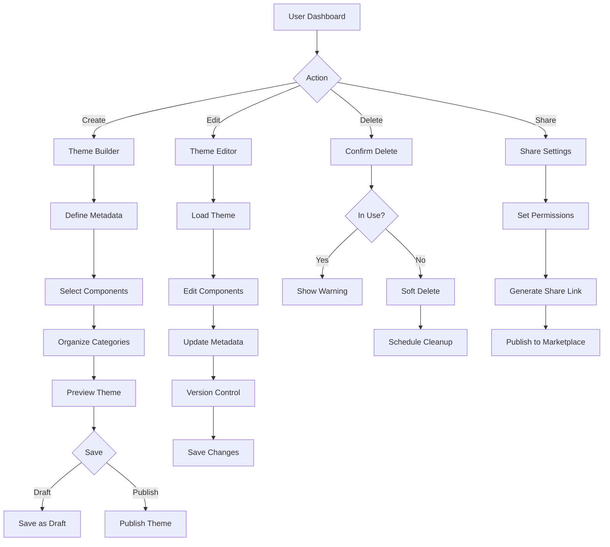
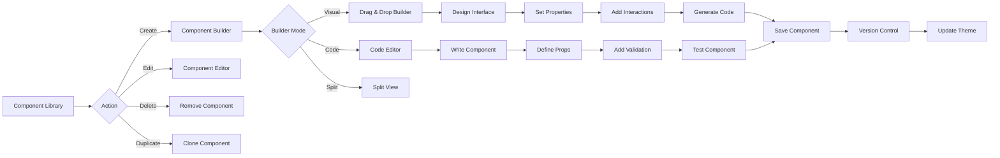
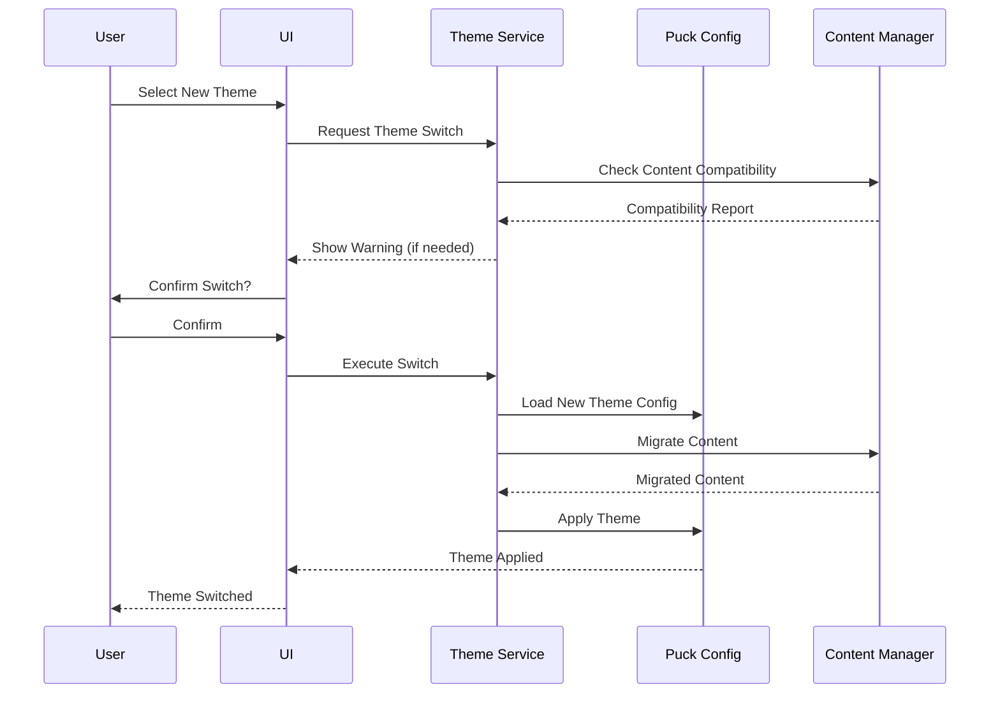
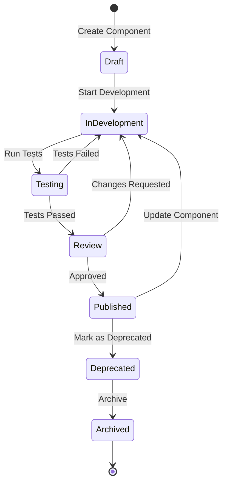
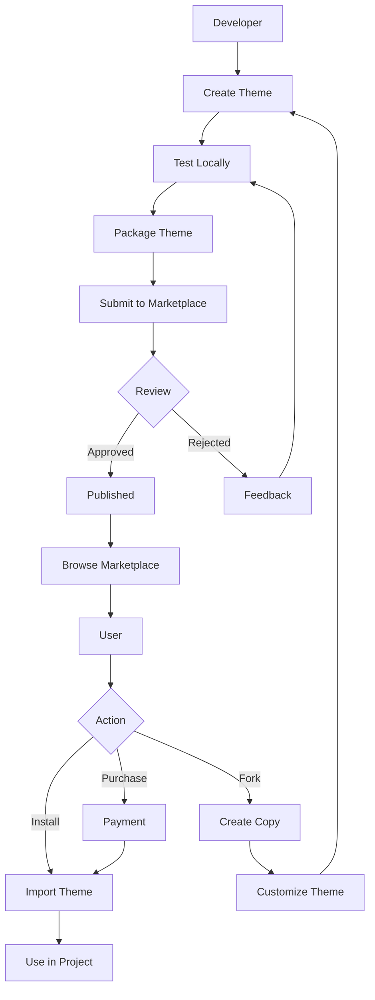
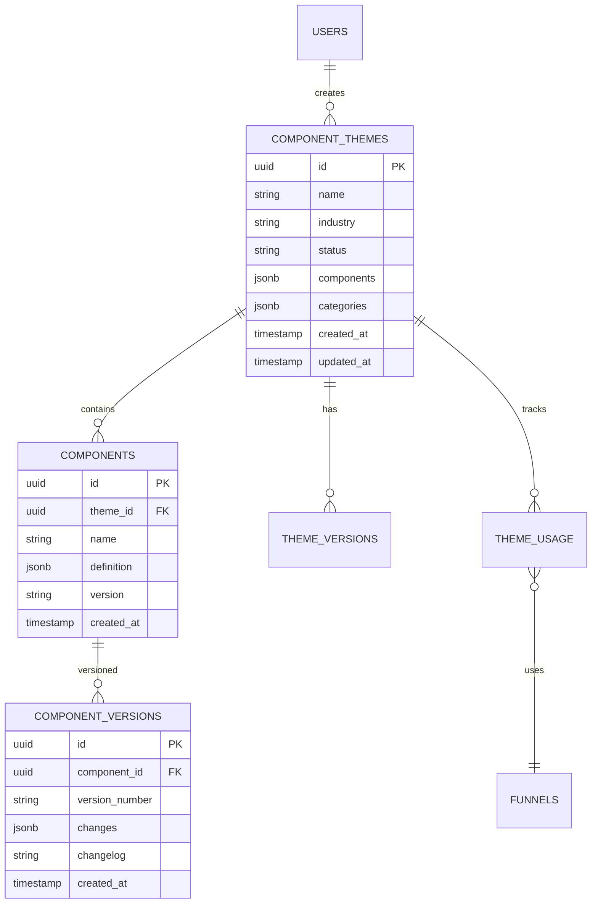
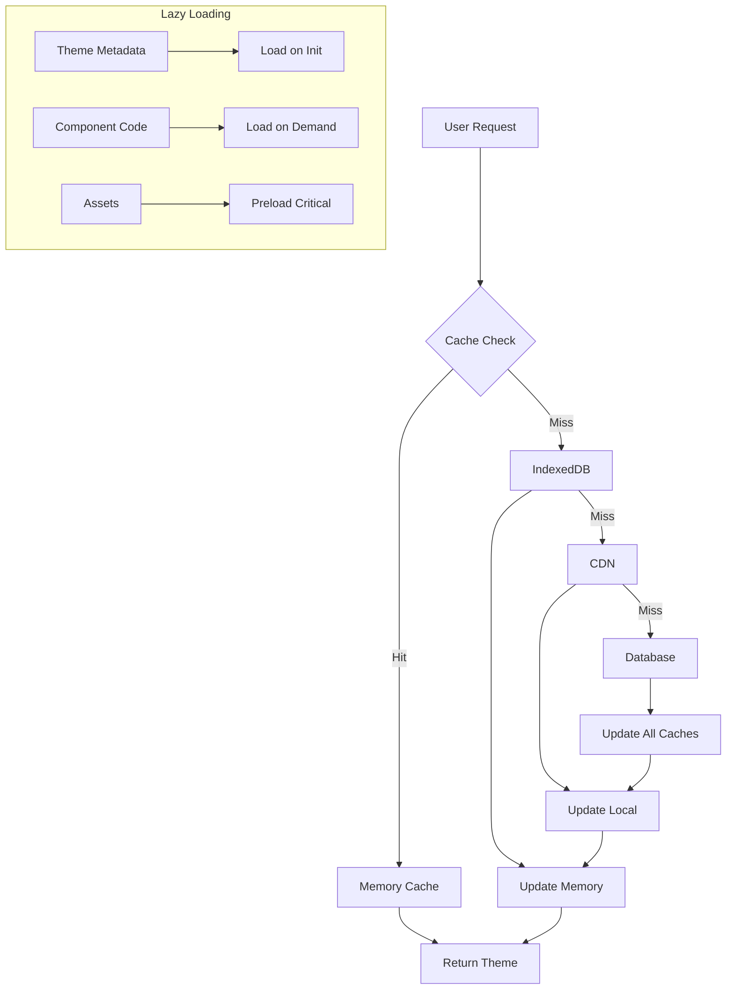
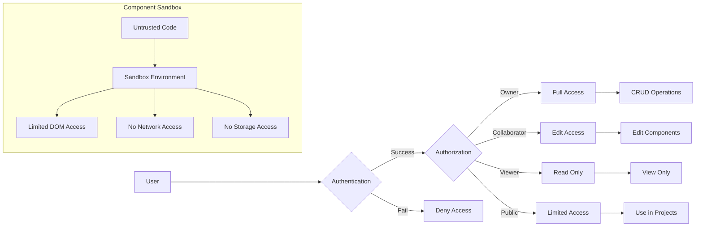
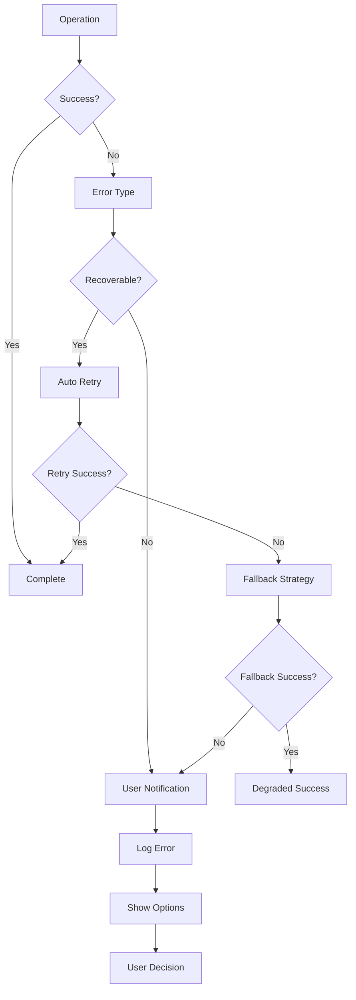

# Theme CRUD System Flow Diagrams

## Theme Management Flow

## Component CRUD Flow

## Theme Switching Flow

## Component Development Lifecycle

## Theme Marketplace Flow

## Database Relationships

## Performance Architecture

## Security Model

## Backup Strategy

```mermaid
gantt
    title Theme Backup Schedule
    dateFormat  HH:mm
    section Hourly
    Quick Save     :done, 00:00, 1h
    Quick Save     :done, 01:00, 1h
    Quick Save     :done, 02:00, 1h
    
    section Daily
    Full Backup    :active, 03:00, 30m
    
    section Weekly
    Archive        :crit, 04:00, 1h
    
    section Monthly
    Offsite Backup :milestone, 05:00, 0m
```

## Error Handling Flow

