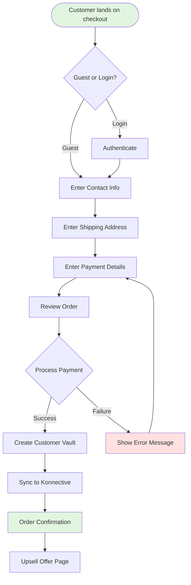
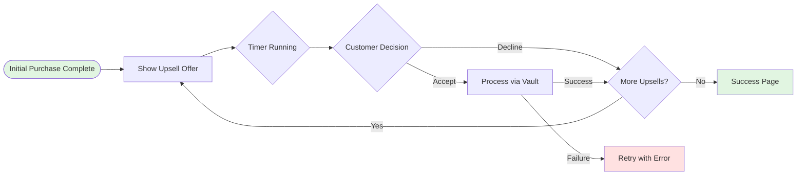
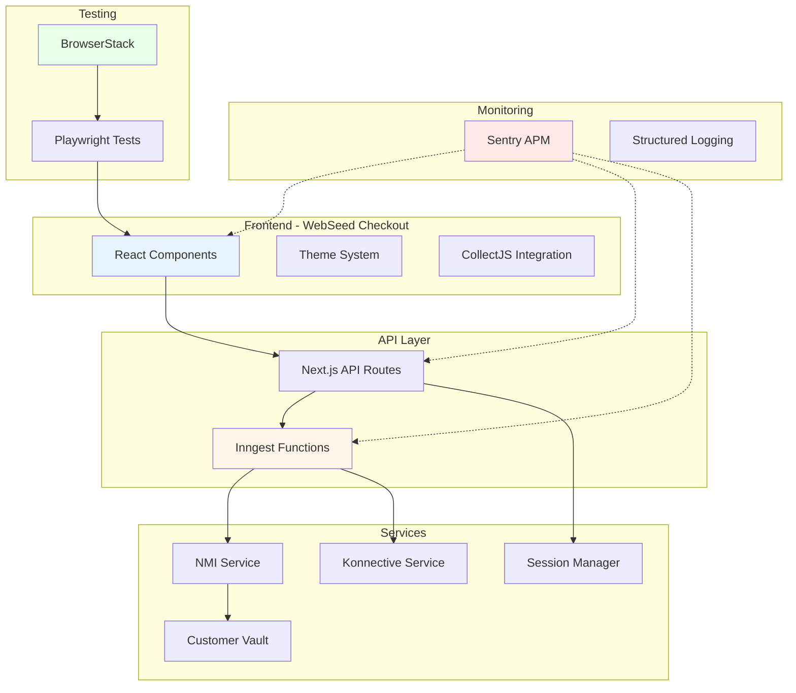
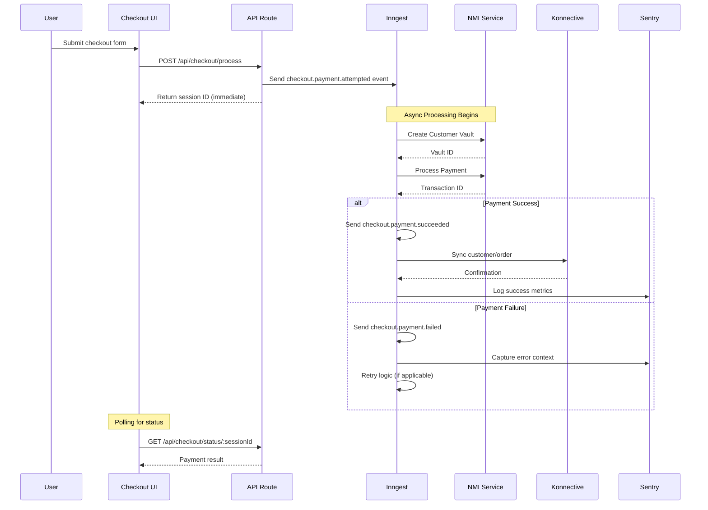
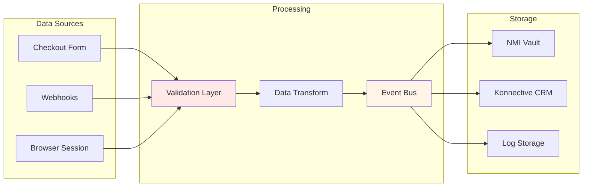
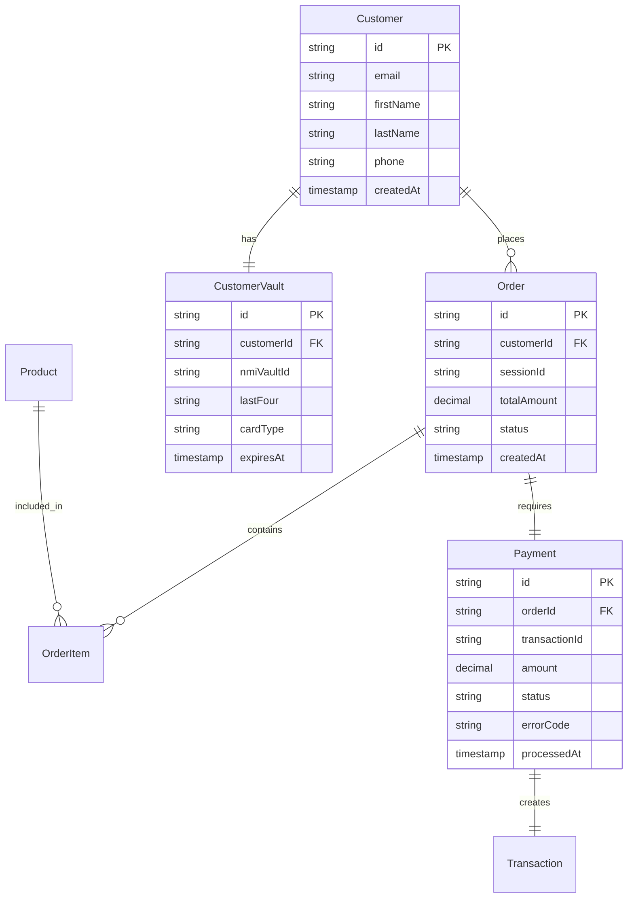
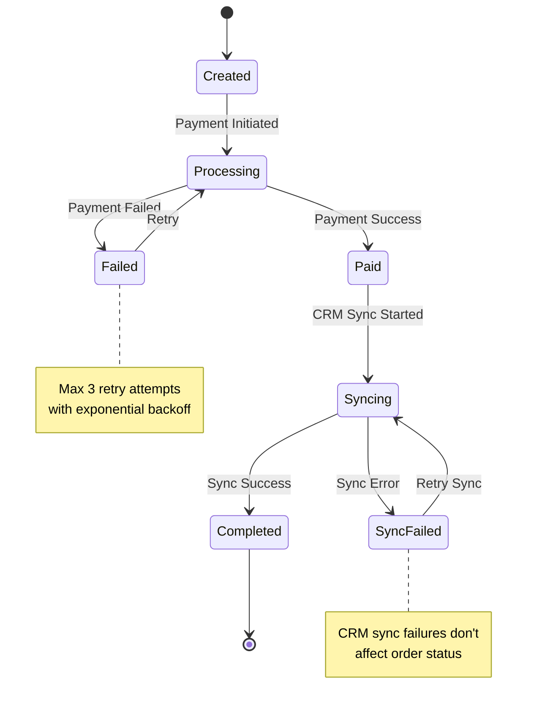
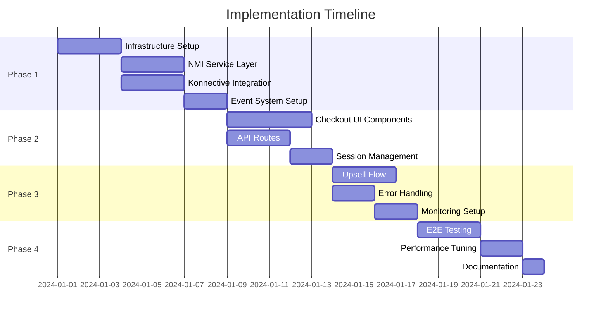
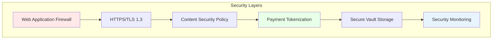
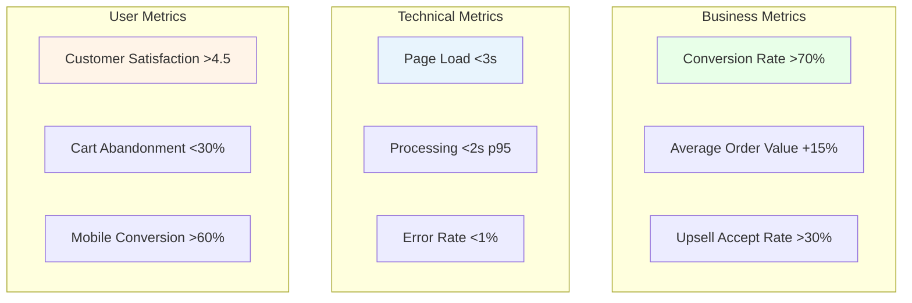

# Product Requirements Document: NMI-Konnective Checkout Integration

## 1. Executive Summary

### Product Vision
Create a seamless, secure, and scalable checkout experience by integrating NMI payment processing and Konnective CRM into the WebSeed theme-based e-commerce platform, leveraging modern event-driven architecture for optimal performance and reliability.

### Key Objectives
- **Conversion Optimization**: Achieve <70% checkout completion rate through streamlined UX
- **Performance**: Sub-3 second checkout page load times with <2s p95 payment processing
- **Scalability**: Support 50+ concurrent checkouts with event-driven architecture
- **Security**: PCI DSS Level 1 compliance with tokenized payment processing
- **Reliability**: 99.9% uptime with automatic retry mechanisms
- **Observability**: Complete monitoring stack for proactive issue resolution

### Success Metrics
| Metric | Target | Measurement Method |
|--------|--------|-------------------|
| Checkout Conversion Rate | >70% | Analytics tracking |
| Payment Success Rate | >95% | Sentry monitoring |
| Page Load Time | <3s | Web Vitals |
| Processing Time (p95) | <2s | Performance monitoring |
| Error Rate | <1% | Sentry dashboard |
| Cross-browser Support | 100% | BrowserStack tests |

## 2. Problem & Solution

### Problem Statement
The current WebSeed checkout lacks:
- Integrated payment processing capabilities
- CRM synchronization for order management
- One-click upsell functionality
- Comprehensive error handling
- Cross-platform testing coverage

### Proposed Solution
Implement a modern checkout system that:
- Integrates NMI for secure payment processing with Customer Vault
- Synchronizes with Konnective CRM for customer/order management
- Uses Inngest for scalable event-driven workflows
- Monitors with Sentry for error tracking and performance
- Tests with BrowserStack for cross-platform compatibility

## 3. User Stories with Diagrams

### Epic: Seamless Checkout Experience

#### Story 1: First-Time Customer Checkout
**As a** first-time customer  
**I want** to complete my purchase quickly and securely  
**So that** I can receive my products without friction

**Acceptance Criteria:**
- [ ] Guest checkout option available
- [ ] Auto-fill for address fields
- [ ] Multiple payment methods supported
- [ ] Clear progress indicators
- [ ] Mobile-responsive design
- [ ] Error messages are helpful and specific

**User Flow Diagram:**


#### Story 2: One-Click Upsell Purchase
**As a** customer who just completed a purchase  
**I want** to add recommended products with one click  
**So that** I don't have to re-enter payment information

**Acceptance Criteria:**
- [ ] Upsell appears immediately after initial purchase
- [ ] Single click to accept offer
- [ ] No payment re-entry required
- [ ] Clear pricing and savings displayed
- [ ] Easy to skip/decline
- [ ] Timer creates urgency

**Upsell Flow Diagram:**


#### Story 3: Mobile Checkout Experience
**As a** mobile user  
**I want** to checkout easily on my phone  
**So that** I can shop anywhere

**Acceptance Criteria:**
- [ ] Touch-friendly form fields (min 44px height)
- [ ] Appropriate keyboards for each field
- [ ] Minimal scrolling required
- [ ] Apple Pay/Google Pay integration
- [ ] Responsive design adapts to screen size
- [ ] Fast load times on mobile networks

## 4. Technical Architecture

### System Architecture Diagram


### Event-Driven Flow Sequence


### Data Flow Architecture


## 5. API Specifications

### Checkout Processing API

#### POST /api/checkout/process
Initiates checkout processing workflow

**Request:**
```typescript
{
  email: string;
  customerInfo: {
    firstName: string;
    lastName: string;
    phone: string;
    address: string;
    city: string;
    state: string;
    zipCode: string;
    country: string;
  };
  paymentToken: string; // From CollectJS
  products: Array<{
    id: string;
    quantity: number;
    price: number;
  }>;
  couponCode?: string;
}
```

**Response:**
```typescript
{
  success: boolean;
  sessionId: string;
  message: string;
  nextStep?: string; // URL for next page
}
```

**Error Response:**
```typescript
{
  success: false;
  error: string;
  errorCode?: string;
  fieldErrors?: {
    [field: string]: string;
  };
}
```

### Session Status API

#### GET /api/checkout/status/:sessionId
Polls for checkout processing status

**Response:**
```typescript
{
  status: 'processing' | 'completed' | 'failed';
  transactionId?: string;
  vaultId?: string;
  error?: string;
  nextStep?: string;
}
```

### Upsell Processing API

#### POST /api/checkout/upsell
Processes one-click upsell purchase

**Request:**
```typescript
{
  sessionId: string;
  productId: string;
  vaultId: string;
}
```

## 6. Data Models

### Entity Relationship Diagram


### State Machine: Order Status


## 7. Implementation Phases

### Phase 1: Foundation (Week 1-2)


### MVP Features
- Basic checkout flow with NMI
- Customer Vault creation
- Konnective order sync
- Error handling
- Session management

### Enhanced Features (Post-MVP)
- One-click upsells
- A/B testing framework
- Advanced analytics
- Subscription management
- Multi-currency support

## 8. Risks & Mitigations

| Risk | Impact | Probability | Mitigation |
|------|--------|-------------|------------|
| NMI API Downtime | High | Low | Implement retry logic, queue failed transactions |
| Konnective Sync Failure | Medium | Medium | Async processing, dead letter queue |
| PCI Compliance Issues | High | Low | Use CollectJS hosted fields, regular audits |
| High Transaction Volume | High | Medium | Event-driven architecture, horizontal scaling |
| Cross-browser Bugs | Medium | Medium | Comprehensive BrowserStack testing |
| Performance Degradation | High | Low | Sentry monitoring, performance budgets |

### Security Considerations


## 9. Success Metrics

### Key Performance Indicators


### Measurement Plan
1. **Conversion Tracking**: Google Analytics + Sentry
2. **Performance Monitoring**: Web Vitals + Sentry APM
3. **Error Tracking**: Sentry error rates by category
4. **User Feedback**: Post-purchase surveys
5. **A/B Testing**: Conversion rate experiments

## 10. Appendices

### A. Integration Documentation Links
- [NMI API Documentation](https://docs.nmi.com/)
- [Konnective API Reference](https://api.konnektive.com/docs/)
- [Inngest Event Documentation](https://www.inngest.com/docs)
- [Sentry Next.js Guide](https://docs.sentry.io/platforms/javascript/guides/nextjs/)
- [BrowserStack Playwright Guide](https://www.browserstack.com/docs/automate/playwright)

### B. Compliance Requirements
- PCI DSS Level 1 compliance required
- GDPR compliance for EU customers
- CCPA compliance for California residents
- ADA/WCAG 2.1 AA accessibility standards

### C. Browser Support Matrix
| Browser | Minimum Version | Testing Priority |
|---------|----------------|------------------|
| Chrome | 100+ | High |
| Safari | 15+ | High |
| Firefox | 100+ | Medium |
| Edge | 100+ | Medium |
| Mobile Safari | iOS 14+ | High |
| Chrome Mobile | Android 10+ | High |

### D. Performance Budgets
| Metric | Budget | Alert Threshold |
|--------|--------|-----------------|
| First Contentful Paint | <1.8s | >2.5s |
| Largest Contentful Paint | <2.5s | >4s |
| Time to Interactive | <3.8s | >5.3s |
| Total Bundle Size | <300KB | >500KB |
| API Response Time | <500ms | >1s |

---

**Document Version**: 1.0  
**Last Updated**: January 2024  
**Status**: Ready for Implementation